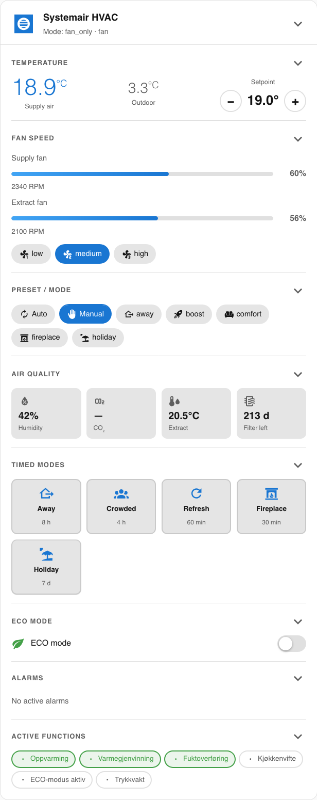

# Systemair HVAC — Lovelace Dashboard



Two files are provided:

| File | Purpose |
|---|---|
| `systemair-card.js` | Custom Lovelace card (JS) with all features in one compact card |
| `systemair-dashboard.yaml` | Full dashboard using both the custom card and standard HA cards |

---

## Custom card installation

1. **Copy the JS file** to your HA config:
   ```
   /config/www/systemair-card.js
   ```

2. **Register the resource** in Home Assistant:
   - Settings → Dashboards → ⋮ menu → Resources → Add resource
   - URL: `/local/systemair-card.js`
   - Type: `JavaScript module`

3. **Add the card** to a dashboard (raw YAML editor):
   ```yaml
   type: custom:systemair-card
   title: Systemair HVAC
   entity: climate.systemair_hvac
   name_prefix: systemair
   show_alarms: true
   show_functions: true
   ```

---

## Card options

| Option | Default | Description |
|---|---|---|
| `entity` | *(required)* | Climate entity ID |
| `title` | `Systemair HVAC` | Card title |
| `name_prefix` | `systemair` | Entity ID prefix (see below) |
| `show_alarms` | `true` | Show active alarms section |
| `show_functions` | `true` | Show active functions section |

---

## Entity prefix

All entities are named based on the device title set during integration setup.
If your device is named **"Systemair HVAC"** the prefix is `systemair`.

To check: **Settings → Devices & Services → Systemair HVAC → Entities**.

Replace `systemair` in the config and YAML files if your prefix differs.

---

## Dashboard YAML

Import `systemair-dashboard.yaml` as a full Lovelace view, or copy individual
card blocks from it. The file contains:

- Custom card (requires the JS resource above)
- `thermostat` card — temperature + fan/preset control
- `glance` cards — air quality sensors, fan speeds
- `grid` card — timed mode launcher buttons
- `entities` cards — active functions + alarms

---

## Features

- **Temperature control** — current supply/outdoor temp display, setpoint ±0.5 °C buttons
- **Fan speed** — animated supply/extract bar, fan mode chips
- **Preset modes** — Away, Boost (Refresh), Comfort (Crowded), Fireplace, Holiday
- **Air quality sensors** — humidity, CO₂, extract temp, filter days remaining
- **Timed modes** — one-tap buttons for all 5 timed modes with default durations
- **ECO mode** — toggle switch
- **Alarms** — badge on header + expandable alarm list
- **Active functions** — chip indicators for heating, cooling, heat recovery, etc.
- **Collapsible sections** — click any section header to collapse/expand
